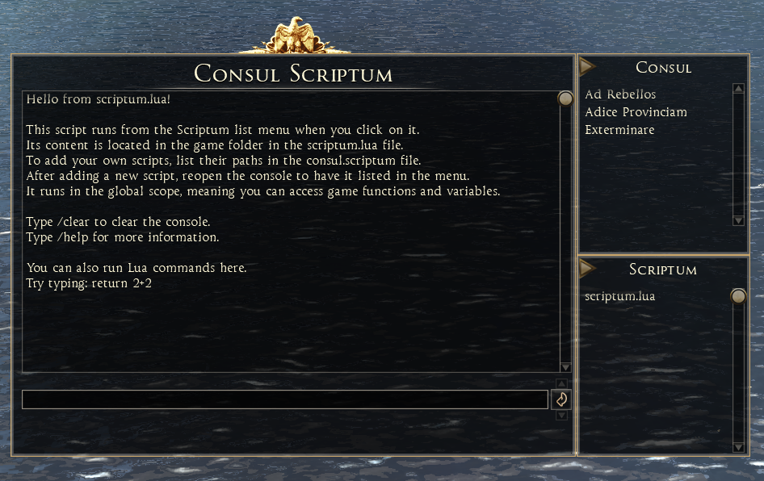
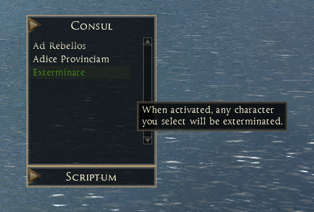

# Consul Scriptum

**Consul**: In ancient Rome, a consul was one of the two highest-ranking elected officials who jointly governed the republic. The term later came to denote high-ranking officials or diplomats in other contexts.

**Scriptum**: This means "written" (from the verb scribere, "to write"). It can refer to a document, text, or written work.

Literally, *"Consul Scriptum"* translates to "written consul" or "the consul's writing." However, this phrasing is not a standard Latin expression or historical term. Its meaning would depend on context: It could metaphorically imply "the written authority" or "a document issued by a consul." In a creative or modern context, it might be used as a title for a fictional work, legal decree, or diplomatic text.

## In reality, this is a scripting console for Total War: Rome II.

## The overall concept is split into three parts:

### Console
The console gives you raw access to Lua and all the extra commands I implement and distribute with the mod.

### Consul (Non-Technical)
A window with a list of scripts that you can activate with a click. This provides a non-technical way to use scripts included in the mod—such as the character-kill script—without needing to interact with the console, making it more immersive.

### Scriptum (Technical)
This allows you to write your own scripts, place them in the game data folder, and execute them with a click. No need to restart the game—just reopen the Consul to load new scripts.

## Included Scripts
Few simple scripts are already included:
- **Ad Rebellos** - Spawns a rebellion in the selected settlement.
- **Adice Provinciam** - Transfers settlement ownership.
- **Exterminare** - Kills any unit or character.

### Extra Features
- You can drag & drop the window.
- You can minimize **Consul** and **Scriptum** by clicking on the arrows, so the console doesn't take up half your screen.
- The tool remembers your position, so it always opens in the same spot.
- Soon, I'll add a feature to remember which panels you have minimized.

### Limitations
- Cannot use **ENTER** to send command.
- Cannot use **arrow keys** to navigate command history.
- Cannot use **TAB** key for command autocomplete.
- Cannot use the **mouse** to select text from command history.
- Cannot paste long commands - but you can type them...?! 🤷 (I have no idea how to handle this and this is very annoying. Current workaround: use scripting files via **Scriptum**, as they load dynamically.)
- **Scriptum** accepts only **10 custom scripts** for now (I can't find a way to dynamically create components - if anyone needs more, just let me know).
- Doesn't work in battle (I can't find a way to access UIComponent in battle - it’s probably restricted on purpose by CA).
