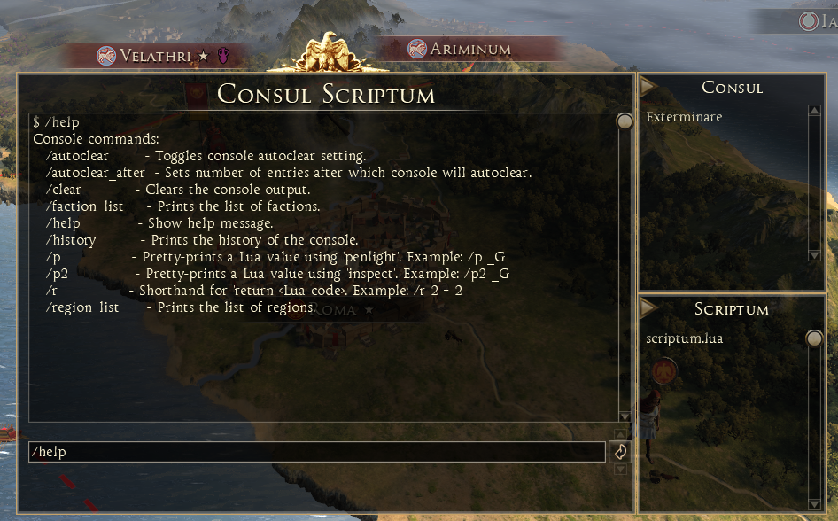
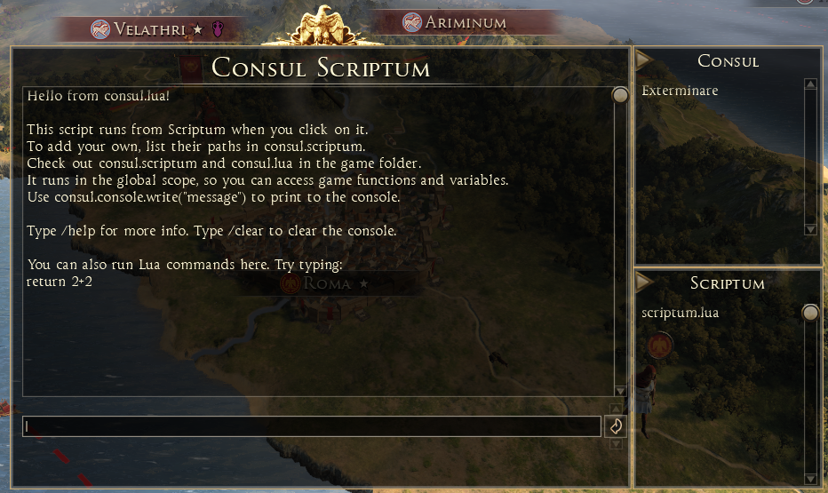

# Consul Scriptum
"Consul Scriptum" is a Latin phrase that combines two terms:

Consul: In ancient Rome, a consul was one of the two highest-ranking elected officials who jointly governed the republic. The term later came to denote high-ranking officials or diplomats in other contexts.

Scriptum: This means "written" (from the verb scribere, "to write"). It can refer to a document, text, or written work.

Literally, "Consul Scriptum" translates to "written consul" or "the consul's writing." However, this phrasing is not a standard Latin expression or historical term. Its meaning would depend on context:
It could metaphorically imply "the written authority" or "a document issued by a consul."
In a creative or modern context, it might be used as a title for a fictional work, legal decree, or diplomatic text.

##### In reality this is a scripting console for Total War Rome 2.

Right now, you can run your own scripts without restarting the game.
I've already added a simple one that lets you kill other characters by clicking on them when it's activated

The overall concept is split into 3 parts (you can drag & drop the window).

- console
  - console gives you raw access to Lua and all the extra commands I implement and distribute with the mod
- consul (window with a list of scripts that you click on) (non-technical)
  - consul gives you non-technical access to scripts that I implement and distribute with the mod (like the kill the character script that a lot of players may like to use and doesn’t require using the console so it’s more immersive)
- scriptum (window with a list of scripts that you click on) (technical)
  - scriptum allows you to write your own scripts, put them in the game data folder, and execute them by clicking on them (doesn’t require a game restart to load new, just reopen the consul)
- extra:
  - you can minimize consul/scriptum by clicking on the arrows so the console doesn’t take up half of your screen (it also remembers your position so it always opens in the same spot, and I just must write a few lines to remember which ones you have minimized)

### Consul
What is consul?

### Scriptum
What is scriptum?

### Limitations:
 - cannot use ENTER to send the command
 - cannot use the arrow keys to navigate the command history
 - cannot use the TAB key to autocomplete the command
 - cannot use the mouse to select text in the command that comes from history
 - cannot paste long commands - but you can type them...?! (I have no idea how to handle this and this is very annoying, the current workaround is to use scripting file via 'scriptum' as this will be loaded dynamically)
 - scriptum accepts only 10 custom scripts for now, i cannot find a way to dynamically create components (if anyone needs more just lmk)
