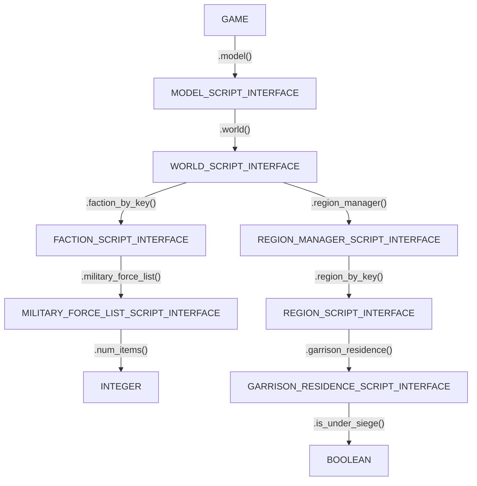

# Scripting Manual

This manual is for anyone who wants to move beyond the built-in commands and start writing their own Lua scripts for Total War. You don't need to be a programmer to start; you just need to understand the engine's scripting architecture.

> [!IMPORTANT]
> To get the most out of this manual, we recommend following the [Suggested Workflow](./scriptum-manual#suggested-workflow) in the Scriptum Manual. It allows you to write code in your text editor and see results live in-game without restarts.

## 1. The Foundation
To do anything in Total War, you first need to require the official interface.
:::tabs key:game

== Attila
```lua
-- load the official Lua library from the base game
scripting = require "lua_scripts.episodicscripting"

-- grab a reference to the GAME interface
local game = scripting.game_interface
```
== Rome II
```lua
-- load the official Lua library from the base game
scripting = require "lua_scripts.EpisodicScripting"

-- grab a reference to the GAME interface
local game = scripting.game_interface
```
:::

> [!TIP]
> **Consul**: Use `consul._game()` for fast prototyping in the console.


### The GAME Interface

The `game` acts as the primary interface between your Lua scripts and the underlying game engine.

::: details Technical Details
The `game` variable is a **C++ Binding**. It serves as the primary interface between the Lua environment and the high-performance **engine core**.

Calling a function on this object triggers a **context-switch**, handing execution over to the engine for simulation updates before returning control to your script.
:::

To keep things simple, just think of the `game` object as having two main powers:

1.  It has the global commands that affect the entire world at once. You can use it to instantly end turns, reveal the whole map, or disable rebellions everywhere.
2.  It is the starting point for finding *anything*. If you want to find a specific general, city, or faction, you **always** start at the `game` variable and follow the "branches" down until you find what you need.

While the next section explains how to **navigate** the hierarchy, below are a few examples of these global commands:

| Power | Method Name | Effect |
| :--- | :--- | :--- |
| **Turns** | `game:end_turn(true)` | Force-ends the current player's turn immediately. |
| **Vision** | `game:show_shroud(false)` | Disables the "Fog of War" across the entire map. |
| **Stability** | `game:disable_rebellions_worldwide(true)` | Prevents all rebellions from spawning globally. |

> [!IMPORTANT]
> **Understanding the API**: The <GameLink hash="game">**Game API Reference**</GameLink> is generated directly from raw engine Lua dumps. Because these are internal bindings, parameter names are often unavailable in the automated reference.
> 
> *   **Parameter Discovery**: To find exact arguments (such as expected keys, IDs, or string values), consult the official **CA Wiki** links in [Section 8](#_8-further-reading-official-wikis).
> *   **Total War Ecosystem**: While this manual supports both games, official engine documentation is only available for **Attila onwards**. However, the engine logic is 99% identical for **Rome II** and highly consistent across other titles discussed in [Section 8](#_8-further-reading-official-wikis).


## 2. Navigating the Game Object Hierarchy

The engine exposes data through a nested **object hierarchy**. To find a specific faction or region, you must traverse the <GameLink hash="game">**GAME**</GameLink> from the root manager down to the specific object you want.

### The Chain of Command

> [!NOTE]
> **Click any node** in the graph below to jump directly to its API definition.

<div class="cs-game-graph-sync">

<div class="cs-game-attila-only">



</div>

<div class="cs-game-rome2-only">


</div>

</div>

**Following the model in code:**

:::tabs key:game

== Attila

```lua
-- Load the GAME interface
scripting = require "lua_scripts.episodicscripting"
local game = scripting.game_interface

-- Example 1: Finding how many armies a faction has
local faction = game:model():world():faction_by_key("att_fact_hunni")
local armies = faction:military_force_list()
local count = armies:num_items() -- Returns an INTEGER

-- Example 2: Checking if a region is under siege
local region = game:model():world():region_manager():region_by_key("att_reg_arabia_felix_zafar")
local residence = region:garrison_residence()
local is_sieged = residence:is_under_siege() -- Returns a BOOLEAN (true/false)

-- Optional Log data to the console
consul.console.clear()
consul.console.write("number of armies: " .. count)
consul.console.write("is siegied: " .. tostring(is_sieged))
```

== Rome II

```lua
-- Load the GAME interface
scripting = require "lua_scripts.EpisodicScripting"
local game = scripting.game_interface

-- Example 1: Finding how many armies a faction has
local faction = game:model():world():faction_by_key("rom_rome")
local armies = faction:military_force_list()
local count = armies:num_items() -- Returns an INTEGER

-- Example 2: Checking if a region is under siege
local region = game:model():world():region_manager():region_by_key("rom_italia_latium")
local residence = region:garrison_residence()
local is_sieged = residence:is_under_siege() -- Returns a BOOLEAN (true/false)

-- Optional Log data to the console
consul.console.clear()
consul.console.write("number of armies: " .. count)
consul.console.write("is siegied: " .. tostring(is_sieged))
```

:::

## 3. Iterating the World: Finding Objects

Once you have access to the `game` variable, you can find objects by using a specific key (like a name) or by iterating through a list (a collection of objects).

### 3.1 Finding Factions
You can find a single faction by its name, or look at every faction in the game.

:::tabs key:game

== Attila

```lua
consul.console.clear() -- Clear the console output

scripting = require "lua_scripts.episodicscripting"
local game = scripting.game_interface
local world = game:model():world()

-- Option A: Find one specific faction
local rome = world:faction_by_key("att_fact_hunni")

-- Option B: Iterate (loop) through ALL factions
local factions = world:faction_list()
for i = 0, factions:num_items() - 1 do
    local fac = factions:item_at(i)
    consul.console.write("Found faction: " .. fac:name())
end
```

== Rome II

```lua
consul.console.clear() -- Clear the console output

scripting = require "lua_scripts.EpisodicScripting"
local game = scripting.game_interface
local world = game:model():world()

-- Option A: Find one specific faction
local rome = world:faction_by_key("rom_rome")

-- Option B: Iterate (loop) through ALL factions
local factions = world:faction_list()
for i = 0, factions:num_items() - 1 do
    local fac = factions:item_at(i)
    consul.console.write("Found faction: " .. fac:name())
end
```

:::

> [!NOTE]
> Check the <GameLink hash="faction-script-interface">**FACTION_SCRIPT_INTERFACE**</GameLink> reference to see what you can do with a faction.


### 3.2 Finding Regions
Regions are handled by a region manager inside the world.

:::tabs key:game

== Attila

```lua
consul.console.clear()

scripting = require "lua_scripts.episodicscripting"
local game = scripting.game_interface
local world = game:model():world()

-- Option A: Find one specific region
local lathium = world:region_manager():region_by_key("att_reg_arabia_felix_zafar")

-- Option B: Iterate through ALL regions in the world
local regions = world:region_manager():region_list()
for i = 0, regions:num_items() - 1 do
    local region = regions:item_at(i)
    consul.console.write("Region: " .. region:name() .. " is owned by " .. region:owning_faction():name())
end
```

== Rome II

```lua
consul.console.clear()

scripting = require "lua_scripts.EpisodicScripting"
local game = scripting.game_interface
local world = game:model():world()

-- Option A: Find one specific region
local lathium = world:region_manager():region_by_key("rom_italia_latium")

-- Option B: Iterate through ALL regions in the world
local regions = world:region_manager():region_list()
for i = 0, regions:num_items() - 1 do
    local region = regions:item_at(i)
    consul.console.write("Region: " .. region:name() .. " is owned by " .. region:owning_faction():name())
end
```

:::

> [!NOTE]
> Check the <GameLink hash="region-script-interface">**REGION_SCRIPT_INTERFACE**</GameLink> reference to see what you can do with a region.


### 3.3 Finding Armies (Military Forces)
To find armies, you must first "drill down" into a specific Faction. Every Faction has its own list of military forces.

:::tabs key:game

== Attila

```lua
consul.console.clear()

local game = scripting.game_interface
local world = game:model():world()
local rome = world:faction_by_key("att_fact_hunni")

-- Get the cabinet of armies for Rome
local armies = rome:military_force_list()

for i = 0, armies:num_items() - 1 do
    local force = armies:item_at(i)
    -- Is it an army or a navy?
    if force:is_army() then
        consul.console.write("Rome has an army at " .. force:general_character():logical_position_x())
    end
end
```

== Rome II

```lua
consul.console.clear()

local game = scripting.game_interface
local world = game:model():world()
local rome = world:faction_by_key("rom_rome")

-- Get the cabinet of armies for Rome
local armies = rome:military_force_list()

for i = 0, armies:num_items() - 1 do
    local force = armies:item_at(i)
    -- Is it an army or a navy?
    if force:is_army() then
        consul.console.write("Rome has an army at " .. force:general_character():logical_position_x())
    end
end
```

:::

> [!NOTE]
> Check the <GameLink hash="military-force-script-interface">**MILITARY_FORCE_SCRIPT_INTERFACE**</GameLink> reference.


## 4. Events: Event-Driven Triggers

An **Event** is a hook into the game engine's simulation. Instead of your script running once and finishing, events allow you to write code that "waits" for something specific to happen in the world—like a player clicking a city, a turn beginning, or a general winning a battle.

### 4.1 Anatomy of a Listener

To react to an event, you "insert" a function into the game's event table. This is often called **registering a listener**. Using `table.insert` is the recommended way to add your logic without overwriting other scripts.

```lua
table.insert(events.SettlementSelected, 
    function(context)
        -- your logic goes here
    end
)
```

> [!TIP]
> **This is how the Consul panel works!**
> When you toggle a button in the [Consul manual](./consul-manual), you aren't just "running a script"—you are essentially activating an event listener that waits for you to click something in the game world before it executes its logic.

> [!IMPORTANT]
> **Case Sensitivity**: Event names are case-sensitive. `SettlementSelected` will trigger correctly, but `settlementselected` will fail silently.

### 4.2 The "Context" Object: The Data Package

When an event triggers your function, the engine hands you a **Context** object. Think of the context as a package containing the objects that are relevant to why the event fired.

If you click a settlement, the `context` contains that settlement. If a turn starts, the `context` contains the faction whose turn it is. This allows you to write one script that behaves differently depending on *who* did *what*.

| Event | Common Context Method | Returns Object |
| :--- | :--- | :--- |
| `SettlementSelected` | `context:garrison_residence()` | <GameLink hash="garrison-residence-script-interface">Garrison Residence</GameLink> |
| `CharacterSelected` | `context:character()` | <GameLink hash="character-script-interface">Character</GameLink> |
| `FactionTurnStart` | `context:faction()` | <GameLink hash="faction-script-interface">Faction</GameLink> |

### 4.3 Practical Examples

Events are the primary way to create interactive mods. Below are examples that work across both Rome II and Attila.

:::tabs key:game

== Attila
```lua
-- 1. Load the toolkit
scripting = require "lua_scripts.episodicscripting"
local game = scripting.game_interface

-- 2. Reacting to a click
-- Print the name of every settlement you click on to the console
table.insert(events.SettlementSelected, 
    function(context)
        local region = context:garrison_residence():region()
        consul.console.write("Inspecting: " .. region:name())
    end
)

-- 3. The "Royal Gift" turn start script
-- Give the player 1000 gold when their turn starts
table.insert(events.FactionTurnStart, 
    function(context)
        local faction = context:faction()
        if faction:is_human() then
            game:treasury_mod(faction:name(), 1000)
            consul.console.write("Royal treasury replenished for " .. faction:name())
        end
    end
)
```

== Rome II
```lua
-- 1. Load the toolkit
scripting = require "lua_scripts.EpisodicScripting"
local game = scripting.game_interface

-- 2. Reacting to a click
-- Print the name of every settlement you click on to the console
table.insert(events.SettlementSelected, 
    function(context)
        local region = context:garrison_residence():region()
        consul.console.write("Inspecting: " .. region:name())
    end
)

-- 3. The "Senate's Gift" turn start script
-- Give the player 1000 gold when their turn starts
table.insert(events.FactionTurnStart, 
    function(context)
        local faction = context:faction()
        if faction:is_human() then
            game:treasury_mod(faction:name(), 1000)
            consul.console.write("Senate treasury replenished for " .. faction:name())
        end
    end
)
```
:::

> [!NOTE]
> Check the <GameLink type="events">**EVENT REFERENCE**</GameLink> to find a full list of available events and their context parameters.

### 4.4 Discovery & Debugging: Peeking Inside

Sometimes you will encounter an event in the reference that has **"No parameters documented."** This doesn't mean it is empty; it just means the engine's internal metadata is hidden from the public reference. You can "peek" inside any event using logging tools.

#### Logging the Context
To see everything a `context` has to offer, you can dump it to the consul.log file or the console. Since the engine's `context` object doesn't tell you its own name, it is best practice to wrap it in a table so your logs are easy to identify:

```lua
table.insert(events.CharacterSelected, 
    function(context)
        -- We wrap the context so we know which event this log belongs to!
        local debug_info = consul.pretty({
            event = "CharacterSelected",
            context = debug.getmetatable(context).__index
        })
        -- write to file
        consul.log:info(debug_info)
        -- or into console
        consul.console.write(debug_info)
    end
)
```
The above will produce:
```lua
{
  ["context"] = {
    ["character"] = "function: 5B083868",
    ["string"] = "",
  },
  ["event"] = "CharacterSelected",
}
```

#### Understanding the Interface
When you look at the log file, you may see a list of functions.
If an event passes a `character` object, the `context` usually has a method like `:character()`.<br> This method returns a full <GameLink hash="character-script-interface">**CHARACTER_SCRIPT_INTERFACE**</GameLink>. This is the gateway to every character power described in the reference.

> [!TIP]
> **Why do this?** Logging the context is the best way to discover data for undocumented events. For example, some battle events might send the `unit` or `alliance` in the context, allowing you to trigger complex scripts exactly when a specific unit routs or catches fire.

### 4.5 Power Tool: Automated Event Logging

If you don't know which event to listen for, you can use Consul's built-in console commands to log **everything** that happens in the game world to the `consul.log` file.

| Command | Description |
| :--- | :--- |
| `/log_events_game` | Logs world events (skips UI components, timers, and shortcuts). |
| `/log_events_all` | Logs **every** engine event (CAUTION: extremely spammy!). |
| `/log_game_event [Name]` | Starts logging a specific engine event by name. |
| `/consul_debug_events` | Toggles persistent event logging (starts at game boot). |

#### Example Output
When one of these commands is active, Consul automatically wraps the context and flattens it into a readable format in your `consul.log`:

```lua
{
  ["_event"] = "PanelOpenedCampaign",
  ["component"] = "Pointer<Component> (0x02f227d8c)",
  ["string"] = "units_panel",
}
```

This is the ultimate discovery tool: simply run `/log_events_game`, go back into the game, click around the UI or move an army, and then check your log file to see exactly which events fired and what data they carried.

#### Catching Early Boot Events
Standard console commands only work once the UI is loaded. If you need to debug events that happen earlier (during the load screen or campaign creation), use the persistent flag:

| Command | Description |
| :--- | :--- |
| `/consul_debug_events` | Toggles persistent event logging. This setting is saved to your config. |

When enabled, Consul starts logging the moment it is loaded in `all_scripted.lua`.

> [!IMPORTANT]
> **Restart Required**: Because boot events fire during the very first seconds of the game's startup sequence, you must **restart the game (or campaign)** after toggling this setting for it to take effect.

### 4.6 The Event Lifecycle: Timing & Safety

Not all events are created equal. Understanding the "Lifecycle" of a session is key to writing stable scripts.

#### Registration Timing
Depending on when an event fires, you might need to register your listener in different places:

- **Episodic Events**: Events like `NewCampaignStarted` fire only once when a new campaign is created. Because these fire before the UI is ready, they must be registered in the engine's base scripts (e.g., `campaigns/<name>/scripting.lua`).
- **Standard Events**: Most world events (clicks, turn starts, battles) fire repeatedly throughout the game. These can be safely registered in any script file, including those loaded by Consul.

#### Safety: The "Golden Hook"
When the game loads, several events fire in sequence. Not all of them are safe for world manipulation:

- **`LoadingGame`**: Runs while the engine is still linking data. Executing complex game functions here can cause crashes.
- **`FirstTickAfterWorldCreated`**: This is the "Golden Hook." It is the earliest point where the world state is fully established and safe to manipulate. It runs **every time** a game is loaded—including when you return to the campaign map from a battle.

#### Battle Transitions & Persistence
In Total War, entering and leaving a battle is not a seamless transition. Behind the scenes:
1. **Entering Battle**: The game saves the campaign state and shuts down the campaign environment.
2. **Leaving Battle**: The game **reloads** the campaign state from scratch.

This means that when you come back from a battle, the engine treats it as a fresh "Load Game" event. All your script variables will be reset to their initial values, and `FirstTickAfterWorldCreated` will fire **again**.

> [!TIP]
> **Persistence (Saving & Loading)**: In Total War, script variables are "volatile." They are wiped every time the campaign reloads—which happens when you load a save file **and** every time you return from a battle. 
>
> To make your script "remember" data permanently (writing it into the `.save` file), you must use the engine's persistence system:
> - **`game:save_named_value(name, value, context)`**
> - **`game:load_named_value(name, default, context)`**
>
> These are typically called inside the **`SavingGame`** and **`LoadingGame`** events, which provide the required `context` in their context.


## 5. Advanced: How "require" works

You will often see `require 'something'` at the top of scripts. This is how you borrow code from other files. Behind the scenes, `require` does two main things: it runs the file once, and it caches the result.

### 5.1 The "Return" Pattern (Recommended)
In Lua, a file can act like a single value. When a file ends with a `return` statement, `require` will capture that value and hand it back to your script. This is the standard way to create tools and libraries.

**1. Create your library file:**
Inside your toolkit file, you create a table, add functions to it, and then return it at the very bottom.

```lua
-- File: my_library.lua
local tools = {}

tools.add = function(a, b) 
    return a + b 
end

return tools  -- Hand the table back to whoever calls require
```

**2. Use it in your main script:**
You capture the returned table in a variable and call the functions inside it.

```lua
-- File: main.lua
local math_kit = require "my_library"

local result = math_kit.add(2, 2)
print(result) -- returns 4
```

### 5.2 The "Global" Pattern (Legacy)
Some older scripts (or scripts that modify the underlying game) don't return anything. Instead, they just define functions directly into the **Global Environment** (the "Global Bucket").

**1. Create your script:**
Notice there is no `return` at the bottom.

```lua
-- File: my_globals.lua
function cheat_money()
    -- This function is now a Global
    game:treasury_mod("rom_rome", 5000)
end
```

**2. Load it in your main script:**
Since nothing is returned, you don't need to assign it to a variable. Call `require` once to "run" the file and populate the environment.

```lua
-- File: main.lua
require "my_globals" -- This runs the file once

cheat_money() -- The function is now available everywhere!
```

### 5.3 Assignment vs. Just Calling
When you use `require`, you have two choices for how you write it. The difference depends on what the file does:

| Style | Result | When to use it |
| :--- | :--- | :--- |
| `local mod = require "file"` | `mod` becomes the **table** returned by the file. | **Best Practice.** Keeps your script clean and prevents naming conflicts. |
| `require "file"` | The code inside runs, but any return value is discarded. | Use this if the file is a **Global Script** that defines things directly into the engine. |

> [!NOTE]
> **What if a Global Script is assigned?** If you write `local my_mod = require "my_globals"` (from the example above), the variable `my_mod` will just be equal to `true`. This is Lua's way of saying "I loaded the file successfully, but it didn't give me any data back."

### 5.5 How Lua finds files
When you call `require "my_folder.my_script"`, Lua doesn't look for a file exactly named that. It uses a set of rules to translate that string into a real file path.

#### 1. The Dot to Slash Translation
Lua treats the dot (`.`) as a folder separator. Before it starts searching, it automatically converts all dots into slashes.

*   `require "episodic_scripting"` → stays same
*   `require "lua_scripts.episodic_scripting"` → becomes `lua_scripts/episodic_scripting`

#### 2. The Search Templates (`package.path`)
Lua looks at a special variable called `package.path`. This is a string containing "templates" separated by semicolons. Each template uses a question mark (`?`) as a placeholder for the module name.

A typical `package.path` might look like this:
`?;?.lua;lua_scripts/?.lua;consul/?.lua`

If you call `require "my_script"`, Lua will try to find:
1.  `my_script` (no extension)
2.  `my_script.lua`
3.  `lua_scripts/my_script.lua`
4.  `consul/my_script.lua`

> [!TIP]
> **Consul Context**: Consul automatically adds its own folders to the `package.path` when it starts up. This is why you can simply write `require "consul_logging"` instead of having to provide the full path to the `src` directory every time.

#### Real-world Discovery
You can check the engine's current paths at any time by running a simple return command in the Consul console:

**Command:**
```powershell
/r package.path
```

**Example Output:**
```lua
C:\Users\<USER>\AppData\Roaming\The Creative Assembly\Attila\maps\?.lua;
C:\Users\<USER>\AppData\Roaming\The Creative Assembly\Attila\maps\campaigns/bel_attila/?.lua;
data/Script/_Lib/?.lua;
data/campaigns/bel_attila/?.lua;
data/campaigns/bel_attila/factions/?.lua;
?.lua;
data/ui/templates/?.lua;
data/ui/?.lua;
consul/?.lua;
```


## 6. Advanced: Lua Environments & The Registry

In Total War, the Lua environment isn't one giant bucket. Instead, the game engine partitions functionality across different **environments**. This is why a variable like `UIComponent` might be available when you are clicking a button, but "missing" if you try to use it in a background campaign script.

### Using the Registry to find "Missing" Objects
The **Lua Registry** is a hidden table that stores almost everything the game loads. If a global is missing in your current context, it's usually still tucked away in the registry.

To discover what is available, use these Consul tools to dump every loaded environment to your `consul.log`:

| Method | Description |
| :--- | :--- |
| `/logregistry` | Console command that logs all registry environments. |
| `consul.debug.logregistry()` | Lua function that performs the same dump. |

### How to "Grab" a missing global
Once you find the name of a missing object in the log (for example, `UIComponent`), you can "grab" it by looping through the registry yourself.

```lua
-- Simple example: searching the registry for UIComponent
for k, v in pairs(debug.getregistry()) do
    local status, env = pcall(debug.getfenv, v)
    if status and type(env) == "table" and env.UIComponent then
        -- We found it! Now we can use it.
        UIComponent = env.UIComponent
        break
    end
end
```

## 7. Putting it All Together:
```lua
to be done
```

## 8. Further Reading: Official Wikis

For a deeper look at the mechanics of Total War scripting, refer to the official Creative Assembly documentation. These guides cover the "Official" toolkit in extreme detail:

- [Total War: ATTILA Kit Scripting](https://wiki.totalwar.com/w/Total_War:_ATTILA_Kit_Scripting.html)
- [Collection of Official Total War Docs](https://chadvandy.github.io/tw_modding_resources/)

> [!TIP]
> While Rome II lacks official documentation from the game developers, Attila is 99% similar.