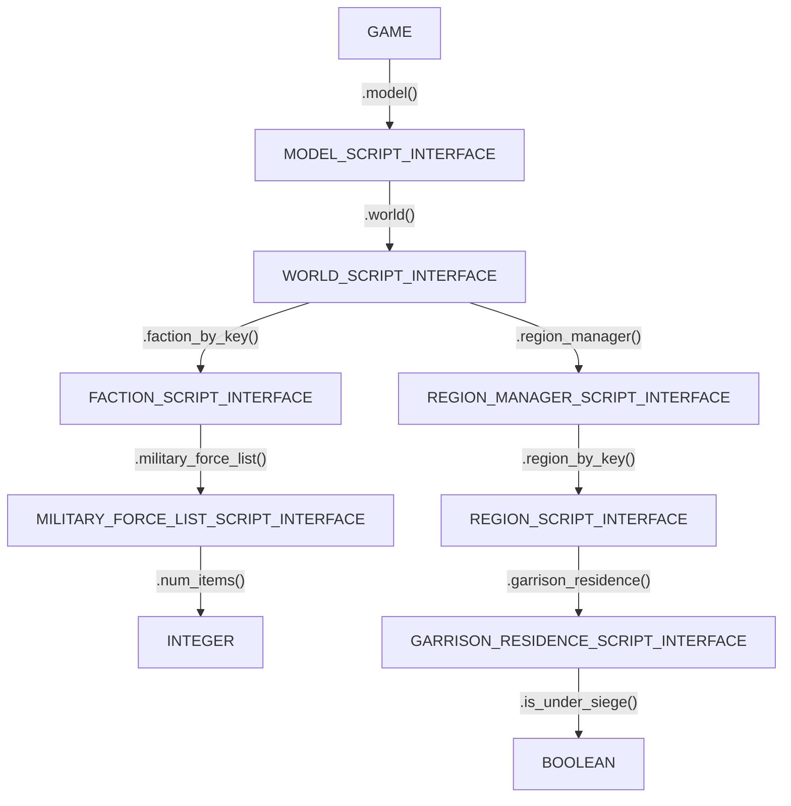

# Scripting Manual

This manual is for anyone who wants to move beyond the built-in commands and start writing their own Lua scripts for Total War. You don't need to be a programmer to start; you just need to understand the engine's scripting architecture.

## 1. The Foundation: Your Tools
To do anything in Total War, you first need to "require" the official toolkit and get the **Manager** for the game library. The variable will be named `game`.

```lua
-- 1. Load the official Game Toolkit
scripting = require "lua_scripts.EpisodicScripting"

-- 2. This is the Official Manager
local game = scripting.game_interface
```

> [!TIP]
> **Consul Shortcut**: You may see `consul._game()` in some examples. This is a built-in shortcut that does the same thing - perfect for fast prototyping in the console!


### The Control Panel: The GAME Interface
The `game` variable is an instance of the [GAME](/reference/attila-api#game) object. It is the **Root Control Panel** of the entire engine. This object is a **binding** created by the game developers to expose C++ engine functions directly to Lua, allowing you to manipulate the game world in real-time.

While Section 2 (The Game Model) shows you how to "find" things, the `game` object itself contains hundreds of direct functions that affect the whole world at once.
Below are few examples of such functions:
| Action | Function Name | What it does |
| :--- | :--- | :--- |
| **Money** | `game:treasury_add()` | Grants gold to a faction. |
| **Life/Death** | `game:kill_character()` | Instantly kills a character. |
| **Events** | `game:trigger_incident()` | Starts a specific historical incident. |
| **Buffs** | `game:apply_effect_bundle()` | Applies a persistent effect from the DB. |

> [!NOTE]
> To see the full list of over 400 global commands available on the game object, consult the [Game API Reference](/reference/attila-api#game). For in-depth tutorials on how these mechanics work together, refer to the official guides in [Section 8: Further Reading](#_8-further-reading-official-wikis).

---

## 2. Navigating the Game Object Hierarchy

The game engine exposes data through a nested **object hierarchy**. To find a specific Faction or Region, you must traverse the **Game** from the root manager down to the specific object you want.

### The Chain of Command
Every script starts with the `GAME`. This is your gateway.

> [!NOTE]
> **Click any node** in the graph below to jump directly to its API definition.



**Following the model in code:**
```lua
-- Load the official Game Toolkit
scripting = require "lua_scripts.EpisodicScripting"
local game = scripting.game_interface

-- Example 1: Finding how many armies a faction has
local faction = game:model():world():faction_by_key("att_fact_rome")
local armies = faction:military_force_list()
local count = armies:num_items() -- Returns an INTEGER

-- Example 2: Checking if a region is under siege
local region = game:model():world():region_manager():region_by_key("att_reg_arabia_felix_zafar")
local residence = region:garrison_residence()
local is_sieged = residence:is_under_siege() -- Returns a BOOLEAN (true/false)
```

> [!IMPORTANT]
> This graph uses links to the **Attila API**. While the core hierarchy is very similar in **Rome II**, there may be few differences. Always check specific game's reference page for the exact functions!
> 
## 3. Iterating the World: Finding Objects

Once you have access to the `game` variable, you can find objects by using a specific key (like a name) or by iterating through a list (a collection of objects).

### 3.1 Finding Factions
You can find a single faction by its name, or look at every faction in the game.

```lua
scripting = require "lua_scripts.EpisodicScripting"

local game = scripting.game_interface
local world = game:model():world()

-- Option A: Find one specific faction
local rome = world:faction_by_key("rom_rome")

-- Option B: Iterate (loop) through ALL factions
local factions = world:faction_list()
for i = 0, factions:num_items() - 1 do
    local fac = factions:item_at(i)
    consul.console.write("Found faction: " .. fac:name())
end
```
> [!NOTE]
> Check the [FACTION_SCRIPT_INTERFACE](/reference/attila-api#faction-script-interface) reference to see what you can do with a faction.

### 3.2 Finding Regions
Regions are handled by a region manager inside the world.

```lua
scripting = require "lua_scripts.EpisodicScripting"

local game = scripting.game_interface
local world = game:model():world()

-- Option A: Find one specific region
local lathium = world:region_manager():region_by_key("rom_italia_latium")

-- Option B: Iterate through ALL regions in the world
local regions = world:region_manager():region_list()
for i = 0, regions:num_items() - 1 do
    local region = regions:item_at(i)
    consul.console.write("Region: " .. region:name() .. " is owned by " .. region:owning_faction():name())
end
```
> [!NOTE]
> Check the [REGION_SCRIPT_INTERFACE](/reference/attila-api#region-script-interface) reference to see what you can do with a region.


### 3.3 Finding Armies (Military Forces)
To find armies, you must first "drill down" into a specific Faction. Every Faction has its own list of military forces.

```lua
local game = scripting.game_interface
local world = game:model():world()
local rome = world:faction_by_key("rom_rome")

-- Get the cabinet of armies for Rome
local armies = rome:military_force_list()

for i = 0, armies:num_items() - 1 do
    local force = armies:item_at(i)
    -- Is it an army or a navy?
    if force:is_army() then
        consul.console.write("Rome has an army at " .. force:general_character():logical_position_x())
    end
end
```
> [!NOTE]
> Check the [MILITARY_FORCE_SCRIPT_INTERFACE](/reference/attila-api#military-force-script-interface) reference to see what you can do with a force.

---


## 4. Events: Event-Driven Triggers

An **Event** is a trigger that executes code when a specific game state changes. Think of it as a listener: "When this event occurs, run this function."

```lua
-- When a settlement is selected (clicked), do something!
table.insert(events.SettlementSelected, 
    function(context)
        local region_name = context:garrison_residence():region():name()
        consul.console.write("You clicked on " .. region_name)
    end
)
```

---

## 5. Advanced: How "require" works

You will often see `require 'something'` at the top of scripts. This is how you borrow code from other files.

### The "Already Done" List
Lua is smart. It keeps a "Done List" (called `package.loaded`). If it's already there, it just hands you the existing version immediately. It **never** reads the file a second time.

---

## 6. Advanced: Registries (Isolated Environments)

The Total War environment is partitioned into isolated execution environments called **Registries**.
- **The UI Registry**: Contains tools for interface manipulation (`UIComponent`).
- **The Campaign Registry**: Contains tools for world state manipulation.

If a tool is missing in your current environment, Consul can "bridge" registries to find it. This is known as **Registry Diving**.

---

## 7. Putting it All Together: A Global Cheat Script

Here is a complete script you can run in **Scriptum**. It finds all human players and gives them 5000 gold.

```lua
-- 1. Load the toolkit
scripting = require "lua_scripts.EpisodicScripting"
local game = scripting.game_interface
-- 2. Follow the Game Model to the Faction List
local factions = game:model():world():faction_list()

-- 3. Loop through every faction
for i = 0, factions:num_items() - 1 do
    local fac = factions:item_at(i)
    
    -- 4. If it's a human, give them gold
    if fac:is_human() then
        consul.console.write("Cheating gold for: " .. fac:name())
        game:treasury_add(fac:name(), 5000)
    end
end
```

---

## 8. Further Reading: Official Wikis

For a deeper look at the mechanics of Total War scripting, refer to the official Creative Assembly documentation. These guides cover the "Official" toolkit in extreme detail:

- [Total War: Attila KIT - Extra Scripting Guides](https://wiki.totalwar.com/w/Total_War:_ATTILA_KIT_-_Extra_Scripting_Guides) — Detailed tutorials on logic, flows, and advanced mechanics.
- [Total War: Attila KIT - Campaign Script Interface](https://wiki.totalwar.com/w/Total_War:_ATTILA_KIT_-_Campaign_Script_Interface) — The full breakdown of the engine's intended scripting architecture.

These are excellent references to use alongside the [API References](/reference/attila-api) when planning complex mods.
